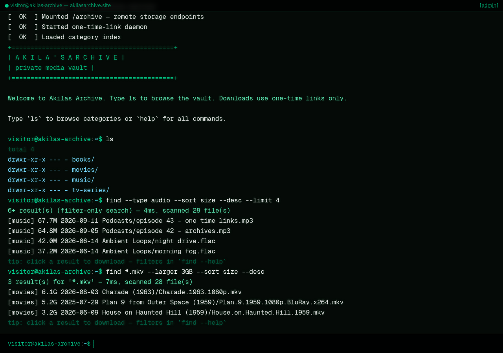
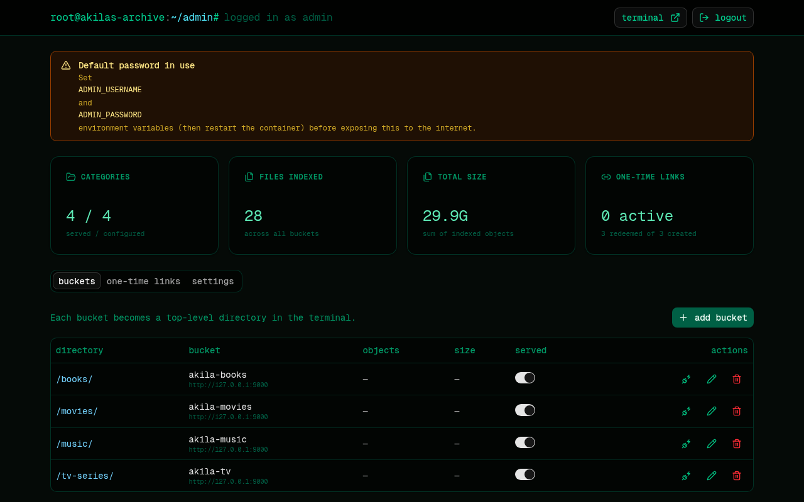
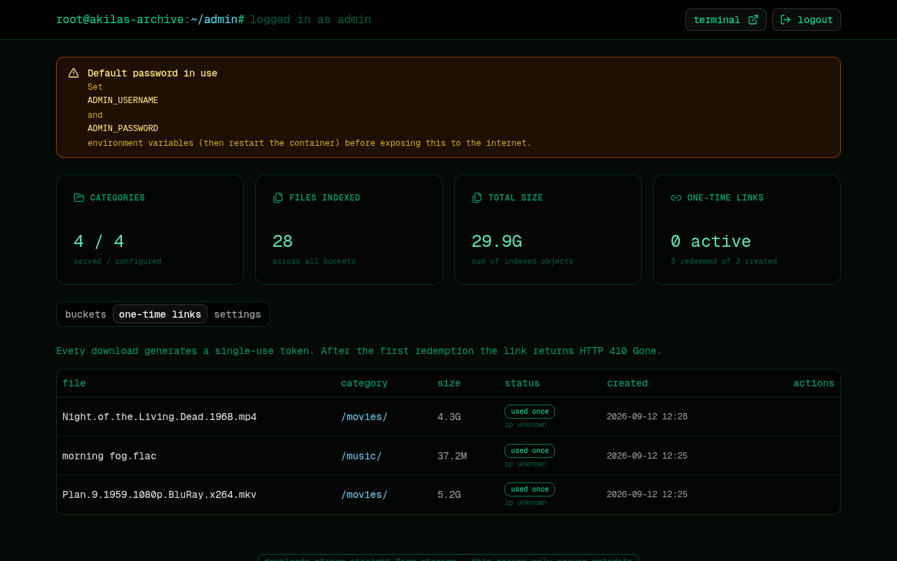

# Akila's Archive

A self-hosted, **terminal-style file archive**. Your buckets appear as
directories on a fake Linux box (`movies/`, `tv-series/`, `music/` …) and every
download is a **one-time link** — there are no public file URLs, and file
traffic never touches your VPS.

> **Stack:** Next.js 16 · SQLite (Prisma) · Docker · Caddy · S3-compatible
> object storage (Cloudflare R2)



---

## Table of contents

1. [How it works (zero VPS bandwidth)](#how-it-works-zero-vps-bandwidth)
2. [Features](#features)
3. [Requirements](#requirements)
4. [Setup — step by step](#setup--step-by-step)
   - [Step 1 — Create a storage API token](#step-1--create-a-storage-api-token)
   - [Step 2 — Point the domain (Namecheap)](#step-2--point-the-domain-namecheap)
   - [Step 3 — Deploy to the VPS](#step-3--deploy-to-the-vps)
   - [Step 4 — First-run checklist](#step-4--first-run-checklist)
5. [Daily usage](#daily-usage)
6. [Configuration reference](#configuration-reference-env)
7. [Ports — coexisting with your existing app](#ports--coexisting-with-your-existing-app)
8. [Updating](#updating)
9. [Backups](#backups)
10. [Production checklist](#production-checklist)
11. [Troubleshooting](#troubleshooting)

---

## How it works (zero VPS bandwidth)

```
Browser ──> https://akilasarchive.site   (Caddy → Docker :3000)
              │  terminal UI, admin panel, tiny JSON APIs (kilobytes)
              │
              └─ POST /api/download ──> one-time token stored in SQLite
                    │
Browser ───────────┘  GET /api/dl/<token>   (first hit only)
              302 redirect ──> short-lived presigned URL (default 5 min)
                    │
                    └──> file streams  STORAGE EDGE → USER
                         VPS bandwidth used for the file: 0 bytes ✔
```

- The VPS only serves the web UI and small API responses.
- File bytes flow **directly from object storage** to the downloader (R2
  egress is free).
- Each link token is **single-use** — redemption is an atomic DB claim; a
  second hit gets **410 Gone**.
- The presigned URL forces `Content-Disposition: attachment` and expires
  quickly (configurable in the admin panel, default 5 min).
- Buckets stay **private** — no public access, no custom bucket domain needed.

## Features

**Terminal UI (`/`)** — a CRT-styled fake shell:

| Command | What it does |
|---|---|
| `ls`, `cd`, `pwd` | Browse categories and folders |
| `tree [dir]` | Recursive listing of a category |
| `find` / `search` | Powerful search — glob, filters, sorting (see below) |
| `stat <file>` | Size / last-modified details |
| `download <file>` | Create a one-time link and start the download |
| `help`, `motd`, `banner`, `neofetch` | The fun ones |
| `clear`, `history`, `whoami`, `date`, `echo`, `exit`, `sudo` | The familiar ones |

Tab completion, ↑/↓ history, clickable rows (search results and `ls` rows
download on click), mobile input bar, CRT scanlines.

### Searching (`find`, alias `search`)

Search runs across **all served categories** at once, powered by a cached
index — queries finish in milliseconds even on large buckets.

```
find plan 9                                 # plain words — ALL must match
find *.mkv --larger 1GB --sort size --desc  # glob + size filter + sort
find --type audio --ext flac --newer 30d    # filter-only (no query needed)
find season* --in tv-series --limit 50      # scope to one category
find --in movies --sort date --desc         # newest additions
```

| Filter | Meaning |
|---|---|
| `--in <category>` | limit to one category |
| `--type <t>` | `video` `audio` `image` `archive` `doc` `other` |
| `--ext <list>` | comma-separated extensions (`--ext mkv,mp4`) |
| `--larger / --smaller` | size bounds (`500`, `500KB`, `1.5GB`, `2TB`) |
| `--newer / --older` | date bounds (`30d`, `12h`, `2w`, `6mo`, `1y`, `2024-01-01`) |
| `--sort` | `relevance` (default) `name` `size` `date` — combine with `--desc` |
| `--limit` | max results (default 300, max 1000) |
| `--json` | machine-readable JSON lines |

Relevance ranking: exact filename match > filename prefix > word-boundary >
substring > path match. Unreachable categories are skipped with a note
instead of failing the whole search. `find --help` prints the full manual.

**Admin panel (`/admin`)**



- Add / edit / remove buckets, each mapped to a directory alias shown in the
  terminal (e.g. bucket `media-movies` → `movies/`)
- Toggle **served** per bucket — instantly hides a category from the public
- One-click connection test per bucket
- One-time link log: status, copy, revoke

- Settings: one-time link validity, presigned URL lifetime, search scan limit,
  message of the day (live in the terminal)

**Security** — timing-safe credential check, HMAC-signed session cookie,
per-IP rate limiting (login + link creation), path-traversal blocked, storage
credentials never returned by the admin API, `noindex` on all pages.

---

## Requirements

- A VPS with **Docker** + **Docker Compose v2** (the app itself)
- A domain — this guide uses `akilasarchive.site` (Namecheap)
- An S3-compatible storage account with a few buckets
  (written for **Cloudflare R2** — free egress makes it ideal)

## Setup — step by step

### Step 1 — Create a storage API token

In the **Cloudflare dashboard → R2 → Manage API tokens → Create API token**:

1. Permission: **Object Read & Write** (read-only also works — the app only
   lists and presigns downloads).
2. Scope: *Apply to specific buckets only* → select the buckets you want to
   serve (or all buckets).
3. Create, then copy:
   - **Access Key ID**
   - **Secret Access Key**
   - **Account ID** — shown next to the endpoint
     `https://<accountid>.r2.cloudflarestorage.com`

You can use one token for all buckets, or one token per bucket — the app
stores credentials per bucket, so both work.

### Step 2 — Point the domain (Namecheap)

In Namecheap → **Domain List → Manage → Advanced DNS**, add two **A records**
(enable "Cloudflare DNS" is *not* required — Caddy issues certificates
directly from Let's Encrypt):

| Type | Host | Value    | TTL       |
|------|------|----------|-----------|
| A    | @    | <VPS-IP> | Automatic |
| A    | www  | <VPS-IP> | Automatic |

Certificate issuance is automatic once DNS resolves and ports 80/443 are
reachable.

### Step 3 — Deploy to the VPS

Designed to run **next to** your existing app on port 8080 — this stack uses
**3001** and optionally its own Caddy container.

```bash
git clone <your-repo-url> akilas-archive && cd akilas-archive

# first-time configuration
cp deploy/.env.example .env
nano .env        # set STORAGE_ACCOUNT_ID, ADMIN_PASSWORD, SESSION_SECRET

# start app + bundled Caddy (auto-HTTPS)
bash deploy/deploy.sh --with-caddy
```

<details>
<summary><b>Alternative: you already run Caddy (or nginx) on the host</b></summary>

```bash
bash deploy/deploy.sh            # starts only the app container
```

Then copy the site blocks from `deploy/Caddyfile` into your **existing**
Caddyfile, replacing `archive:3000` with `localhost:3001`, and reload:

```bash
sudo caddy reload --config /etc/caddy/Caddyfile
```
</details>

When the containers are up:

| URL | What |
|---|---|
| `https://akilasarchive.site` | Terminal UI |
| `https://akilasarchive.site/admin` | Admin panel |
| `http://<vps-ip>:3001` | Direct app access (no domain yet) |

### Step 4 — First-run checklist

1. Log in at `/admin` with `ADMIN_USERNAME` / `ADMIN_PASSWORD` from your `.env`.
   (If you kept the defaults, a warning banner nags you until you change them.)
2. **Buckets → add bucket**: pick the directory alias shown in the terminal
   (e.g. `movies`), enter the real bucket name + access key / secret, then hit
   the ⚡ **test connection** button.
3. Toggle **served** → the category appears in the terminal immediately.
4. Adjust **Settings** — link validity, presigned URL lifetime, welcome
   message.
5. Open the terminal, `ls` your categories, `download` something — the link
   works **exactly once**, then 410s forever.

## Daily usage

- Visitors get the terminal at `/` — no login, read-only browsing + one-time
  downloads.
- You manage everything at `/admin` — bucket on/off switches take effect
  immediately, no restart needed.
- Links are `https://akilasarchive.site/d/<token>`-style one-timers: send one
  to a friend, it dies after the first download or when it expires (default
  24 h), whichever comes first.

## Configuration reference (`.env`)

| Variable             | Required | Description |
|----------------------|----------|-------------|
| `STORAGE_ACCOUNT_ID` | yes      | Builds the default S3 endpoint (`https://<id>.r2.cloudflarestorage.com`). Legacy name `R2_ACCOUNT_ID` still accepted. |
| `ADMIN_USERNAME`     | yes      | Admin panel login |
| `ADMIN_PASSWORD`     | yes      | Admin panel password — **change the default!** |
| `SESSION_SECRET`     | yes      | Random string for cookie signing (`openssl rand -base64 48`) |
| `PUBLIC_BASE_URL`    | no       | Force the base URL used in one-time links |
| `PUBLIC_HOSTNAME`    | no       | Hostname shown in the terminal UI |

Runtime tunables live in the admin panel → Settings (stored in SQLite):
one-time link validity (default 24 h), presigned URL lifetime (default 300 s),
search scan limit per bucket (default 20 000), MOTD.

## Ports — coexisting with your existing app

| Port   | Used by | Notes |
|--------|---------|-------|
| 8080   | your existing Docker webapp | untouched |
| 3001   | akilas-archive (host mapping) | change in `deploy/docker-compose.yml` if you prefer another |
| 80/443 | bundled Caddy | only with the `proxy` profile (`--with-caddy`) |

If your 8080 app should also get a domain, uncomment the
`app.akilasarchive.site` block in `deploy/Caddyfile` and add the DNS record.

## Updating

```bash
git pull
bash deploy/deploy.sh --with-caddy   # rebuilds + restarts, data persists in ./data
```

## Backups

Everything stateful lives in **`./data/akilas-archive.db`** (SQLite): bucket
config + credentials, one-time link history, settings. Back up that one file
and you're done. Deleting a bucket in the panel never deletes your objects in
storage.

## Local development (optional)

Want to hack on the app without touching real storage? Start the bundled
fake S3 and point the demo buckets at it:

```bash
bun scripts/mock-s3.ts &            # fake S3 on :9000 (28 demo files)
bun scripts/set-demo-endpoint.ts    # point buckets at http://127.0.0.1:9000
bun run dev                         # next dev on :3000
bun scripts/search-selftest.ts      # search engine unit checks
```

## Production checklist

- [ ] Changed `ADMIN_PASSWORD` and `SESSION_SECRET` from the defaults
- [ ] Storage token scoped to only the buckets being served
- [ ] `deploy/deploy.sh --with-caddy` running (auto-HTTPS + HTTP→HTTPS redirect)
- [ ] Containers restarted with `restart: unless-stopped` (default in compose)
- [ ] `./data/` included in your backup routine
- [ ] Occasional `docker compose logs archive` glance for surprises

## Troubleshooting

| Symptom | Fix |
|---|---|
| `test connection` fails with an auth error | Re-create the storage API token; check for trailing spaces in `.env` |
| Test fails with `Bucket does not exist` | Bucket name must match exactly (case-sensitive) |
| Certificate not issued | Check DNS propagation; ensure ports 80/443 reach the Caddy container |
| Container fails writing the DB | `sudo chown -R 1001:1001 ./data` |
| Download link says **410** | Expected after first use or expiry — generate a new one |
| `find` says *truncated* | Raise **search scan limit** in Settings, or refine the query |
| Port 3001 already in use | Change the host mapping in `deploy/docker-compose.yml`, then update your Caddyfile target |

---

## Repository layout

```
├── src/
│   ├── app/                  # Next.js routes (terminal UI, /admin, JSON APIs)
│   │   ├── api/              # fs, tree, search, download, dl/[token], admin/*
│   │   └── admin/            # admin panel page
│   ├── components/
│   │   ├── terminal/         # the fake shell (commands, rendering)
│   │   └── admin/            # dashboard, bucket manager, link log, settings
│   └── lib/                  # storage client, search engine, auth, cache, settings
├── prisma/schema.prisma      # Bucket / LinkToken / Setting models (SQLite)
├── deploy/
│   ├── Dockerfile            # multi-stage, non-root, standalone build
│   ├── docker-compose.yml    # app (:3001) + optional Caddy (proxy profile)
│   ├── Caddyfile             # akilasarchive.site + www redirect
│   ├── deploy.sh             # git-pull friendly deploy/update script
│   └── .env.example          # configuration template
├── scripts/
│   ├── mock-s3.ts            # local fake S3 for dev/E2E (bun scripts/mock-s3.ts)
│   ├── search-selftest.ts    # search engine unit checks (bun scripts/search-selftest.ts)
│   └── set-demo-endpoint.ts  # point demo buckets at the mock
└── docs/screenshots/         # UI screenshots used by this README
```
